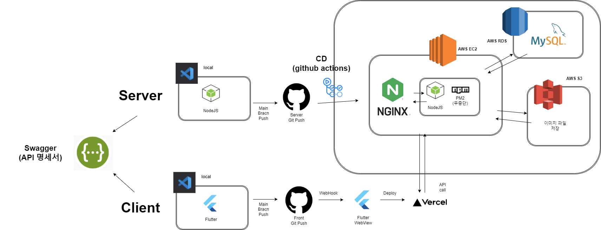

## QJ

### 소개
이 문서는 QJ 서비스의 기술적인 부분과 아키텍처에 대한 정보를 제공합니다.
QJ란 Question Job으로, 관심 직무(또는 직업)을 바탕으로 Chat GPT에게 학교 강의를 추천받는 서비스입니다.
추천을 받을 때는, 5점 만점 중에서 반드시 들어야 하는 과목은 5점에 가깝고, 들을 필요성이 적은 과목은 0점에 가깝습니다.

### 기술 스택
- **Node.js**: 서버 측 프로그래밍을 위한 JavaScript 런타임 환경
- **Express.js**: Node.js 웹 애플리케이션 프레임워크
- **MySQL**: 관계형 데이터베이스 시스템
- **AWS**: 클라우드 서비스로써 EC2, RDS, Route53, S3를 사용
- **Swagger**: 서버 개발자와 클라이언트 개발자들이 보기 쉽게 API 명세서를 기록 (https://kauqj.shop/api-docs)
- **github actions**: 서버 자동 배포를 위해 CD 구축

### AWS 구성

AWS에서는 다음과 같은 서비스를 사용했습니다.

- **EC2**: 20.04 Ubuntu, t2.micro 인스턴스 1대 사용
- **RDS**: MySQL 사용
- **Route53**: 도메인 구매 및 관리 (도메인: https://kauqj.shop)
- **S3**: 이미지 파일 URL 처리

### 다이어그램

아래는 서비스 아키텍처를 보여주는 다이어그램입니다.



### 구조

```
├── * .github                               # github actions
│   ├── workflows
│   │   ├── deploy.yml                      # Continuous Deploy
├── src
│   ├── config                              # 환경 설정
│   │   ├── baseResponseStatus.js           # Response 시의 Status 모음.
│   │   ├── database.js                     # 데이터베이스 관련 설정
│   │   ├── express.js                      # express Framework 설정 파일
│   │   ├── multer.js                       # S3 설정 파일
│   │   ├── response.js                     # HTTP 요청에 대한 응답을 구성
│   │   ├── winston.js                      # logger 라이브러리 설정
│   │   ├── swagger                         # API 문서
│ 	│   │   ├── board.yaml
│ 	│   │   ├── homepage.yaml
│ 	│   │   ├── jobdictionary.yaml
│ 	│   │   ├── mypage.yaml
│ 	│   │   ├── qj.yaml
│ 	│   │   ├── swagger.js                  # swagger 설정
│ 	│   │   ├── user.yaml
│   ├── controller                          # req, res 처리
│ 	│   ├── boardController.js
│ 	│   ├── homeController.js
│ 	│   ├── jobguideController.js
│ 	│   ├── mypageController.js
│ 	│   ├── qjController.js
│ 	│   ├── userController.js
│   ├── crawler
│ 	│   ├── crawler-scheduler.js            # 크롤링 일정
│ 	│   ├── recruit.crawler.js              # 크롤링 처리 코드
│   ├── dao                                 # query 처리
│ 	│   ├── boardDao.js
│ 	│   ├── homeDao.js
│ 	│   ├── jobguideDao.js
│ 	│   ├── mypageDao.js
│ 	│   ├── qjDao.js
│ 	│   ├── userDao.js
│   ├── middleware                          # 미들웨어
│ 	│   ├── jwtMiddleware.js
│ 	│   ├── gptMiddleware.js
│   ├── provider                            # Read 처리
│ 	│   ├── boardProvider.js
│ 	│   ├── homeProvider.js
│ 	│   ├── jobguideProvider.js
│ 	│   ├── mypageProvider.js
│ 	│   ├── qjProvider.js
│ 	│   ├── userProvider.js
│   ├── route                               # route(endpoint) 처리
│ 	│   ├── boardRouter.js
│ 	│   ├── homeRouter.js
│ 	│   ├── jobguideRouter.js
│ 	│   ├── mypageRouter.js
│ 	│   ├── qjRouter.js
│ 	│   ├── userRouter.js
│   ├── service                             # CUD 처리
│ 	│   ├── boardService.js
│ 	│   ├── homeService.js
│ 	│   ├── jobguideService.js
│ 	│   ├── mypageService.js
│ 	│   ├── qjService.js
│ 	│   ├── userService.js
│   ├── app.js                              # 포트 설정 및 시작 파일(상위 라우터)
├── .gitignore                              # git 에 포함되지 않아야 하는 폴더, 파일들을 작성 해놓는 곳
├── LICENSE
├── package-lock.json
├── package.json                            # 프로그램 이름, 버전, 필요한 모듈 등 정보 기술
└── README.md
```

## 패턴: CQRS

이 프로젝트는 CQRS (Command Query Responsibility Segregation) 패턴을 따르고 있습니다.

CQRS 패턴은 명령(Command)과 조회(Query)를 분리함으로써 시스템의 확장성을 향상시키는 아키텍처 패턴 중 하나입니다. 명령과 조회가 서로 다른 모델을 가질 수 있도록 하여, 서비스의 확장성 및 유지보수성을 향상시킬 수 있습니다.

### 특징
- **명령(Command):** 시스템 상태를 변경하는 동작을 수행합니다. 주로 Create, Update, Delete (CUD)에 해당합니다.
- **조회(Query):** 시스템의 상태를 반환하거나 표시하는 동작을 수행합니다. 주로 Read (R)에 해당합니다.

### 장점
- **성능 최적화:** 명령과 조회의 부하를 분리함으로써 각각에 최적화된 방식으로 처리 가능합니다.
- **유연성 및 확장성:** 명령과 조회에 대한 서비스를 각각 확장하거나 변경할 수 있습니다.
- **모델 분리:** 명령에 사용되는 모델과 조회에 사용되는 모델을 분리함으로써 각각의 역할에 맞게 모델을 설계할 수 있습니다.

이 프로젝트에서는 명령과 조회를 각각 다루는 서비스 및 모델을 구성하여 시스템 아키텍처를 보다 유연하고 효율적으로 관리하고 있습니다.